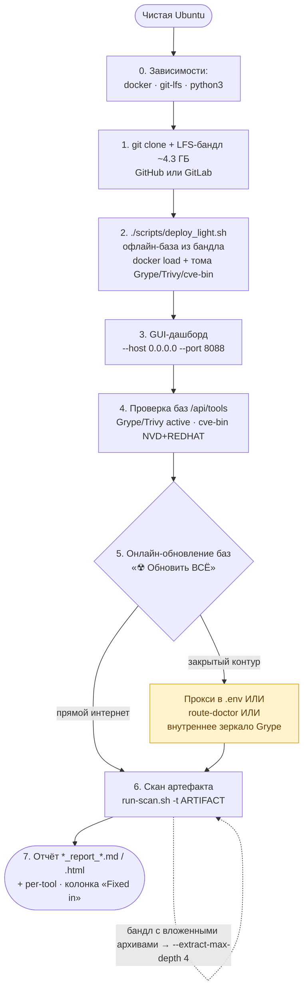

# Установка и запуск SCA-комплекса на Ubuntu (с нуля, для нового человека)

Комплекс анализирует артефакты на уязвимости (**Syft + Grype + Trivy + cve-bin-tool**):
даёшь файл → получаешь отчёт. Код, docker-образы и базы приходят одним `git clone`
(через Git LFS) — на машине ничего не собирается. Инструкция рассчитана на **чистую,
ранее не настроенную Ubuntu**, где комплекс ставится впервые.

> Подставляйте свои значения вместо плейсхолдеров:
> `<SERVER_IP>` — IP вашего сервера · `<ARTIFACT>` — путь к вашему артефакту ·
> `$INSTALL_DIR` — каталог установки.

---

## Схема развёртывания (обзор)



> Текстом тот же поток: **зависимости → клон+бандл → `deploy_light` → GUI → проверка
> баз → онлайн-обновление (при закрытом контуре — прокси/зеркало) → скан → отчёт.**
> Подробности каждого шага — ниже.

---

## 0. Требования и установка зависимостей

**Железо/ОС:** Ubuntu 20.04+ (или Linux x86_64), 4 ГБ RAM (лучше 8+), 2 ядра (лучше
4+), и **≥ 40 ГБ свободного диска** в каталоге установки (бандл ~4.3 ГБ + образы +
тома БД ~30 ГБ + место под распаковку артефактов).

Установка зависимостей (один раз):

```bash
# Docker Engine + Compose v2
curl -fsSL https://get.docker.com | sudo sh
sudo usermod -aG docker "$USER"        # ВАЖНО: затем перелогиньтесь (или `newgrp docker`)
# git + git-lfs + python
sudo apt-get update
sudo apt-get install -y git git-lfs python3 python3-pip python3-venv
git lfs install
```

Проверка:

```bash
docker version            # должна быть секция Server (демон запущен)
docker compose version    # v2.x
git lfs version
python3 --version         # 3.10+
```

---

## 1. Каталог установки и клонирование

Выберите каталог на диске с запасом места (пример — `/opt/sca-work`, подойдёт и `~`):

```bash
export INSTALL_DIR=/opt/sca-work
sudo mkdir -p "$INSTALL_DIR" && sudo chown "$USER:$USER" "$INSTALL_DIR"
cd "$INSTALL_DIR"
GIT_TERMINAL_PROMPT=0 git clone https://github.com/Eljees/el-sca-ansamble.git
cd el-sca-ansamble
ls -lh bundle/ | head     # части бандла должны весить сотни МБ, а НЕ ~130 байт
```

Если файлы в `bundle/` крошечные (это указатели LFS) → `git lfs pull`.
Запасной источник, если GitHub недоступен:
`https://gitlab01.soc.rt.ru/yurij.m.tumanov/el-sca-ansamble.git`.

---

## 2. Развёртывание (офлайн-база из бандла)

```bash
./scripts/deploy_light.sh
```

Скрипт сам: пишет `.env` (strict offline), пересобирает бандл из частей,
`docker load` образов, восстанавливает тома Grype/Trivy/cve-bin-tool, активирует
снимок Grype. Ожидаемый финал: **`done — fully offline`**. Сеть тут не нужна.

---

## 3. GUI-дашборд

```bash
python3 -m pip install fastapi "uvicorn[standard]" python-multipart
# (Ubuntu 24 + ошибка "externally-managed-environment" → добавьте --break-system-packages)
python3 -m resilient_updates.cli dashboard --repo-root . --host 0.0.0.0 --port 8088
```

Открыть в браузере: **`http://<SERVER_IP>:8088`** (или `http://127.0.0.1:8088` на
самой машине). `--host 0.0.0.0` нужен, чтобы открыть с другого компьютера.

---

## 4. Проверка, что базы на месте

```bash
curl -s http://127.0.0.1:8088/api/tools | python3 -m json.tool | \
  grep -E '"name"|"db_status"|"db_updated"|"fill"'
```

Норма: **Grype** `active`, fill 100, дата **не старше 5 дней**; **Trivy** `active`,
fill 100; **cve-bin-tool** — наполнены NVD/REDHAT (часть доп-источников может быть
0 — это норма). Те же «бочки» видны в GUI (блок «БАЗЫ ИНСТРУМЕНТОВ»); кнопка
«Обновить статус» перечитывает наполненность.

> ⚠️ **Возраст базы Grype критичен.** Сканер отвергает БД старше ~5 дней
> (`failed to load vulnerability db: … was built … ago`). Снимок из бандла может
> быть старше → перед сканом обновите Grype онлайн (шаг 5).

---

## 5. Онлайн-обновление баз (через GUI)

В браузере `http://<SERVER_IP>:8088` → блок «БАЗЫ ИНСТРУМЕНТОВ» →
**«☢ Обновить ВСЁ»**. В логе «ПРОЦЕСС АНАЛИЗА»: `route-doctor` ищет egress, затем
тянутся trivy → grype → cve-bin-tool. По завершении — **«Обновить статус»**, бочки
наливаются.

Если у сервера есть прямой интернет — этого достаточно. Если нет или CDN режется —
см. [Закрытый контур](#закрытый-контур--внутреннее-зеркало).

---

## 6. Скан артефакта (любого)

```bash
./scripts/run-scan.sh -t <ARTIFACT>
```

Поддержка: `.tar.gz/.tgz/.zip/.apk/.deb/.whl/.exe/.msi` и др. Стадии:
extract → syft (SBOM) → trivy → grype → cve-bin-tool → report. Прерванный скан
продолжается с места обрыва: добавьте `--resume`.

**Два правила корректного скана:**

1. **Без пробелов/скобок в имени файла.** Иначе syft падает
   `could not determine source … resolve '/scan-target'`. Если имя «грязное» —
   сделайте hardlink с чистым именем (без копирования, без лишнего диска):
   ```bash
   ln -f "грязное имя (1).gz" clean.tar.gz
   ./scripts/run-scan.sh -t "$PWD/clean.tar.gz"
   ```
2. **Бандлы с вложенными архивами** (`.tgz`/`.zip` внутри внешнего архива) сканируйте
   с рекурсией, иначе будут **ложные «0 находок»** (внешний слой распакуется, а
   вложенные сервисы — нет):
   ```bash
   ./scripts/run-scan.sh -t <ARTIFACT> --extract-max-depth 4
   ```

---

## 7. Результат

```bash
ls -la <папка_артефакта>/*report*            # *_report_<дата>.md и .html рядом с артефактом
ls -la artifacts/reports/final/              # index.html + сводный отчёт
# сводка находок grype по severity:
python3 - <<'PY'
import json,collections
d=json.load(open('artifacts/reports/grype/report.json'))
c=collections.Counter((m.get('vulnerability') or {}).get('severity') for m in d.get('matches',[]))
print('matches:',len(d.get('matches',[])),dict(c))
PY
```

Готовые отчёты: `*_report_<дата>.md` (читать), `*_report_<дата>.html` (общий),
плюс per-tool `_grype/_trivy/_cve-bin-tool/_syft.html`.

---

## Обновление баз: VPN, прокси и закрытый контур

### Почему cve-bin-tool обновился, а grype/trivy — нет

Это типичная картина в корпоративных сетях, где `grype.anchore.io` и `ghcr.io` (GitHub)
заблокированы, но `nvd.nist.gov` / `redhat.com` доступны:

- **cve-bin-tool** скачивает данные с NVD/REDHAT/OSV — государственные и open-source
  домены, обычно проходят через корпоративный фильтр.
- **Grype** требует `grype.anchore.io` (или запасной `toolbox-data.anchore.io`).
- **Trivy** требует `ghcr.io` (GitHub Container Registry) или `public.ecr.aws`.

Встроенный failover пробует оба источника Grype и оба источника Trivy (ECR). Если оба
недоступны — обновление не проходит.

### Вариант 1: прокси в `.env`

Если на сервере есть HTTP- или SOCKS5-прокси (корпоративный, v2rayN, xray и т.п.),
пропишите его один раз в `.env` — все три инструмента подхватят автоматически:

```bash
# В el-sca-ansamble/.env — добавьте нужные строки:

# Корпоративный HTTP-прокси:
HTTP_PROXY=http://proxy.corp.example.com:3128
HTTPS_PROXY=http://proxy.corp.example.com:3128
NO_PROXY=localhost,127.0.0.1

# Или SOCKS5 (v2rayN / xray на хосте):
ALL_PROXY=socks5h://host.docker.internal:10808
NO_PROXY=localhost,127.0.0.1
```

Перезапустите дашборд после изменения `.env`. Теперь «☢ Обновить ВСЁ» использует
прокси.

> **Важно — SOCKS5 и HTTPS_PROXY не совмещать:**  
> Если прокси — SOCKS5, указывайте только `ALL_PROXY`, не `HTTPS_PROXY`.
> Go-бинарники (Grype, Trivy) отдают приоритет `HTTPS_PROXY` перед `ALL_PROXY`,
> и попытка HTTP CONNECT на SOCKS5-порт приведёт к ошибке.
> `ALL_PROXY=socks5h://...` без `HTTPS_PROXY` работает правильно.

### Вариант 2: route-doctor (автообнаружение)

Если на хосте запущен любой прокси (v2rayN на порту 10808 или другом стандартном),
route-doctor обнаружит его при каждом запуске «Обновить ВСЁ» и автоматически
настроит маршруты. Результат сохраняется в `artifacts/route-plan.env`.

Просмотреть текущий план:
```bash
cat artifacts/route-plan.env
cat artifacts/route-plan.json  # JSON с деталями
```

### Вариант 3: внутреннее зеркало Grype

Если сервер не достаёт `grype.anchore.io` вообще, раздайте базу с **любой машины,
у которой есть доступ** (CI, рабочий ПК в другой сети — НЕ обязательно сам сервер):

```bash
# на машине С доступом к anchore — скачать свежую v6 и отдать по HTTP:
mkdir -p v6 && curl -s https://grype.anchore.io/databases/v6/latest.json -o v6/latest.json
A=$(python3 -c "import json;print(json.load(open('v6/latest.json'))['path'])")
curl -s "https://grype.anchore.io/databases/v6/$A" -o v6/db.tar.zst
python3 - <<'PY'   # path с двоеточиями -> чистое имя файла
import json;d=json.load(open('v6/latest.json'));d['path']='db.tar.zst'
open('v6/latest.json','w').write(json.dumps(d))
PY
python3 -m http.server 8901 --bind 0.0.0.0
```

На сервере в `configs/feed_sources.yaml` → `grype.upstream_update_urls`, запись
`internal-grype-mirror`: `url: http://<MIRROR_IP>:8901/v6/latest.json`,
`enabled: true` (priority 10 — пробуется первой). Затем «Обновить ВСЁ» в GUI или
`./scripts/run-scan.sh --update-db` — это само импортирует базу в кэш сканера.

---

## Траблшутинг

| Симптом | Причина | Решение |
|---|---|---|
| `git clone`: файлы `bundle/` ~130 байт | git-lfs не подтянул | `git lfs pull` |
| `deploy_light` не находит образ-тар | очень старый клон | обновить репо или `./scripts/deploy_light.sh bundle` |
| скан-grype: `database was built … ago` | база Grype старше 5 дней | обновить Grype онлайн (шаг 5) |
| grype-update: `anchore.io Read timed out` | CDN режется в контуре | failover → внутреннее зеркало или прокси в `.env` |
| grype/trivy не обновились, cve-bin-tool OK | anchore.io/ghcr.io заблокированы, NVD доступен | настроить прокси в `.env` (см. раздел «Обновление баз: VPN, прокси») |
| `HTTPS_PROXY=socks://...` не работает | Go игнорирует SOCKS в HTTPS_PROXY | использовать `ALL_PROXY=socks5h://...` без `HTTPS_PROXY` |
| свежий grype не виден сканеру | не импортирован в кэш | `docker compose --profile airgap run --rm grype-db-importer` (или `run-scan --update-db`) |
| cve-bin: `Database does not exist` (exit 40) | старый образ (исправлено: `HOME=/home/appuser` в compose) | обновить репо; стадия не фатальна — отчёт соберётся |
| syft: `could not determine source '/scan-target'` | пробел/скобки в имени артефакта | hardlink/переименовать в имя без пробелов |
| скан бандла = `0 находок` (обманка) | вложенные архивы не распакованы | `--extract-max-depth 4` |
| `rm` не удаляет каталог | внутри файлы от root (артефакты прошлых сканов) | `sudo rm -rf …` |
| долгий скан обрывается | нестабильный сервер / перезагрузки | обеспечить стабильный аптайм; повторить с `--resume` |
| `df` «не меняется» | каталог установки — отдельный mount | смотреть `df` именно на `$INSTALL_DIR` |

---

## TL;DR (есть прямой интернет)

```bash
# 0) один раз: зависимости (docker, git-lfs, python) — см. шаг 0
export INSTALL_DIR=/opt/sca-work
sudo mkdir -p "$INSTALL_DIR" && sudo chown "$USER:$USER" "$INSTALL_DIR" && cd "$INSTALL_DIR"
git lfs install && git clone https://github.com/Eljees/el-sca-ansamble.git && cd el-sca-ansamble
./scripts/deploy_light.sh
python3 -m pip install fastapi "uvicorn[standard]" python-multipart
python3 -m resilient_updates.cli dashboard --repo-root . --host 0.0.0.0 --port 8088 &
#  → браузер http://<SERVER_IP>:8088 → «☢ Обновить ВСЁ» → «Обновить статус»
./scripts/run-scan.sh -t <ARTIFACT> --update-db --extract-max-depth 4
```

---

## Приложение: наш тестовый прогон (это НЕ требования, а пример)

Проверено на сервере `192.168.1.33`, деплой в `/opt/sca-work`, пользователь `elaria`.
Артефакт-пример **CYBERSEC-11603** (`makarov-i-686402 (1).gz`, 2 ГБ, бандл фронтенда
`distr/services/*.tgz`):
- при `--extract-max-depth 0` → 1 архив, **0 находок** (обманка);
- при `--extract-max-depth 4` → **50 архивов, 254 находки** (1 CRITICAL, 37 HIGH,
  67 MEDIUM; grype 105 / trivy 73 / cve-bin-tool 76), policy `fail`.

Особенности именно нашего стенда (у вас будут другими, на инструкцию не влияют):
`/opt/sca-work` смонтирован как отдельный диск `sdb1`; сервер периодически
перезагружался (~20–30 мин), из-за чего длинные сканы приходилось повторять с
`--resume`. Базовые фиксы (автодетект бандла, failover Grype, `HOME` для cve-bin,
нефатальный cve-bin) уже в репозитории — на свежем клоне ничего из этого делать не
нужно.
